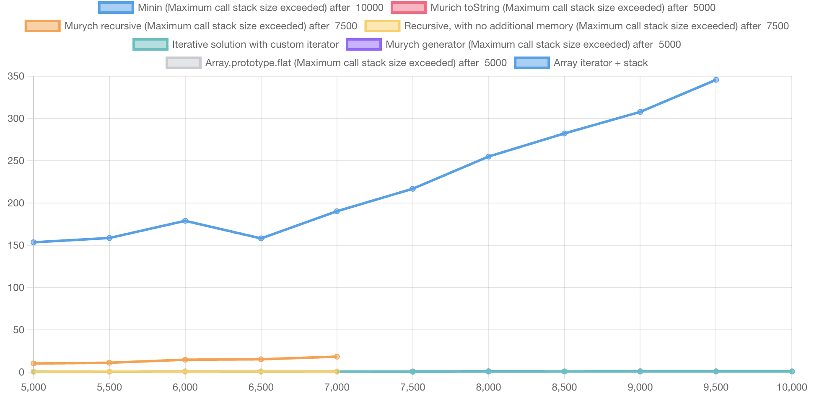
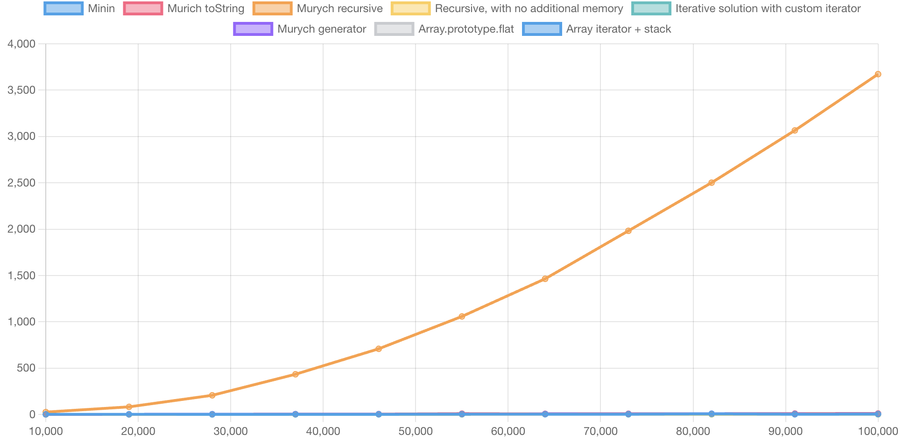

Разбор решения задачи flatten из [этого видео](https://www.youtube.com/live/ICwDR01RgnA?si=CBdWRZfVGz6r5m8d&t=1186)


## Задача
Написать аналог Array.prototype.flat(Infinity)


### toString
https://www.youtube.com/live/ICwDR01RgnA?si=tsIXD7W2auMaqYvo&t=2151

Мурыч показывает решение основанное на методе `toString` массива. 
https://262.ecma-international.org/14.0/#sec-array.prototype.tostring


```js
var flatten = (
    ( theArr ) => {
        return theArr.toString().split(',');
    }
)
```

Далее Мурыч почему-то перескакивает на 
https://262.ecma-international.org/14.0/#sec-object.prototype.tostring
И говорит что вот тут описан рекурсивный алгоритм. Но это не так.
Cпецификация ведет в Array.prototype.join, в котором и описана рекурсия.
https://262.ecma-international.org/14.0/#sec-array.prototype.join

тоесть, можно просто вызвать `theArr.join().split(',')`


### Рекурсивное решение

https://www.youtube.com/live/ICwDR01RgnA?si=0oUyDaLOR5M8U5c0&t=2331

Мурыч предлагает написать рекурсивное решение.

https://www.youtube.com/live/ICwDR01RgnA?si=qkcVlFMJRH3PoBRD&t=3140
```js
var flatten = (
    ( theArr ) => {
        var theResultArray=[];
        var doIsArray = Array.isArray;

        for (var theValue of theArr) {
            doIsArray(theValue)
                ? (theResultArray = theResultArray.concat(flatten(theValue)))
                : theResultArray.push(theValue);
        }

        return theResultArray;
    }
)
```

https://www.youtube.com/live/ICwDR01RgnA?si=VSlMqipOCNplyTLO&t=3306
Мурыч смотрит байткод

и показывает почему лучше уменьшить количество обращений к проперти

```js
var doIsArray = Array.isArray;
```


https://www.youtube.com/live/ICwDR01RgnA?si=QCGy-WSE8VzE1Ken&t=4199
Мурыч говорит что через строку способ самый оптимальный, но у него есть недостаток
Он все приводит к строке, а это противоречит логике задачи.
Это верное наблюдение, однако мурыч прав что для чисел решение будет работать.
Откуда информация что это самый оптимальный способ - он не сказал.

### Решение от Минина

https://www.youtube.com/live/ICwDR01RgnA?si=sURDPoZGpdAn4tni&t=4446

```js
function flatten(array) {
    const res = [];
    for (let i = 0; i < array.length; i++) {
        if (Array.isArray(array[i])) {
            const flat = flatten(array[i]);
            for (let j = 0; j < flat.length; j++) {
                res.push(flat[i]);
            }
        }
        else {
            res.push(array[i]);
        }
    }
    return res;
}
```

Говорит что решение Минина представляет из себя пример недоразумения
Которое пишется на коленке.

Два вложенных for,
Гонит вложенный цикл
Array.isArray
Говорит что Минин не знает о for of
Тут говорит что раньше forOf был медленный, поэтому на автомате все его используют
https://www.youtube.com/live/ICwDR01RgnA?si=acsfdx7ud8KaTSKS&t=4496

Тут Мурыч уже не сравнивает байткод, а в байткоде для for of как есть дополнительные команды

Говорит что обращение к array[i] медленное.


Тут https://www.youtube.com/live/ICwDR01RgnA?si=_FCKY-XJ3W9wubaS&t=4713 
Мурыч верно говорит про то что, concat быстрее чем пуш в массив.
Называет решение хрюканиной
Тут соведущему смешно про хрюканину https://www.youtube.com/live/ICwDR01RgnA?si=ag9PvH93AqMPKU8g&t=4770


### Генераторы

https://www.youtube.com/live/ICwDR01RgnA?si=ywfD_HwicyQ9Icc6&t=6022

Мурыч показывает это решение

```js
var doFlat = (
    function* ( theArr ) {
        var theValue;
        var doIsArray = Array.isArray;
        for (theValue of theArr) {
            if (doIsArray(theValue)) {
                yield* doFlat(theValue);
            } else {
                yield theValue;
            }
        }
    }
)

var flatten = (
    ( theArr ) => {
        return [...doFlat(theArr)];
    }
)
```


## Мои комментарии на разбор Мурыча
В комментариях под видео я оставил комментарий что разбор слабый.
Попробую объяснить это здесь.


### Предложенное рекурсивное решение медленное
Рекурсивное решение, написанное Мурычем:

```js
var flatten = (
    ( theArr ) => {
        var theResultArray=[];
        var doIsArray = Array.isArray;

        for (var theValue of theArr) {
            doIsArray(theValue)
                ? (theResultArray = theResultArray.concat(flatten(theValue)))
                : theResultArray.push(theValue);
        }

        return theResultArray;
    }
)
```

1. Рассмотрим пример входного массива вида

```js
[
    [0,[1],2,[3],4,[5],n]
]
```
Который может быть получен с помощью такой функции

```js
function generate2LvelsArray(n) {
    const res = []

    for (let i = 0; i< n; i++) {
        if (i % 2 === 0) {
            res.push(i)
        } else {
            res.push([i])
        }
    }
    
    return res;
}
```

Если рассмотреть по шагам, Cтанет видно что на каждом нечетном элементе мы делаем `concat`` одного элемента со всем накопленным результатом.
`Сoncat` согласно спецификации делает копию массива, а не мутирует его. Копирование имеет сложность `O(N)`, где `N` - длина массива.
Алгоритм Мурыча сделает `O(N^2)` шагов.
Обратите внимание что при таких данных, решение Минина сделает `O(N)` шагов.

```js
function flatten(array) {
    const res = [];
    for (let i = 0; i < array.length; i++) {
        if (Array.isArray(array[i])) {
            const flat = flatten(array[i]);
            for (let j = 0; j < flat.length; j++) {
                res.push(flat[i]);
            }
        }
        else {
            res.push(array[i]);
        }
    }
    return res;
}
```

Для решения Минина можно так же подобрать данные при которых алгоритм покажет `O(N^2)` сложность.

Основная проблема (И преимущество) решения Мурыча и Минина в том, что рекурсия возвращает новый массив. Поэтому приходится объединять результаты на каждом уровне рекурсии.

Если изменить имплементацию так что рекурсия будет модифицировать входной массив, а не возвращать новый, то можно избавиться от `concat` и сделать `O(N)` шагов.


```js
var flatten = (
    ( theArr ) => {
        var doFlat = (
            ( theArr, result ) => {
                var doIsArray = Array.isArray;
                for (var theValue of theArr) {
                    doIsArray(theValue)
                    ? doFlat(theValue, result)
                    : result.push(theValue);
                }
            }
        )
        
        var result = [];

        doFlat(theArr, result);

        return result;
    }
)
```

Именно такое решение описано в cпецификации [Array.prototype.flat](https://262.ecma-international.org/14.0/#sec-array.prototype.flat).
В абстрактную функцию [FlattenIntoArray](https://262.ecma-international.org/14.0/#sec-flattenintoarray)
передается массив и там модифицируется.
Имплементация V8 точь в точь соответствует спецификации.
Дополнительно, можно посмотреть на реализацию этого метода в библиотеках `lodash` и `rambda`


### Ограничение по глубине рекурсии

Решения Минина и Мурыча имеют ограничение по глубине рекурсии.

Это легко увидеть если входящий массив вида

```js
[
    [0,[1,[2,[3,[4,...[n]]]]]]
]
```

Который может быть получен с помощью такой функции

```js
function generateDeepArray(depth) {
    let res = [];
    var root = res;
    for (let i = 0; i < depth; i++) {
        res.push(i);
        var nextLevel = [];
        res.push(nextLevel);
        res = nextLevel;
    }
    return root;
}
```

В браузере chrome вы получите ошибку `Uncaught RangeError: Maximum call stack size exceeded`
Если сгенерируете массив с глубиной больше 7000 (возможно в вашем окружении это будет другое число)

Важно отметить, такая же проблема есть и в [Array.prototype.flat](https://262.ecma-international.org/14.0/#sec-array.prototype.flat)
B [lodash.flatten](https://github.com/lodash/lodash/blob/aa18212085c52fc106d075319637b8729e0f179f/src/.internal/baseFlatten.ts#L25)

Чтобы решить эту проблему предлагается рассмотреть итеративное решение.

Например такое

```js
function flatten(array) {
    var res = [];
    var isArray = Array.isArray;

    var top = new NestedIterator(null, array);

    while (top) {
        if (top.hasNext()) {
            var val = top.next();
            if (isArray(val)) {
                var newTop = new NestedIterator(top, val);
                top = newTop;
            } else {
                res.push(val);
            }
        } else {
            top = top.prev;
        }
    }

    return res;
}

class NestedIterator {
    constructor(prev, list) {
        this.index = -1;
        this.list = list;
        this.prev = prev;
    }

    hasNext() {
        return this.index < this.list.length - 1;
    }

    next() {
        const val = this.list[++this.index];
        return val;
    }
}
```

Тут мы создаем стек итераторов, причем не используем AxoticObjectArray для этого, просто строим стек на основе односвязного списка.

Или с использованием [array[Symbol.iterator]](https://tc39.es/ecma262/multipage/indexed-collections.html#sec-array.prototype-@@iterator)
И exotic object array


```js
function flatten(array) {
    var res = [];
    var isArray = Array.isArray;

    var stack = [array[Symbol.iterator]()];

    while (stack.length) {
        var top = stack.pop()
        for (var val of top) {
            if (isArray(val)) {
                stack.push(top);
                stack.push(val[Symbol.iterator]());
                break
            } else {
                res.push(val);
            }
        }
    }

    return res;
}
```
Важно заметить, я тут не пытаюсь сказать что это самое оптимальное решение.


Тут можно посмотреть на все решение и сравнить их на разных входных данных.

Я написал эту запускалку изначально именно чтобы исследовать `flatten`
И назвал ее balablol.js, так как в своем комментарии на youtube, мурыч написал что надеется что я не балабол и свяжусь с ним по поводу публичного стрима.

[flatten-comparison](https://stepancar.github.io/Big-Oops.js/build/#code/%7B%22solutions%22%3A%5B%7B%22id%22%3A%2216972736615520.24072079035909688%22%2C%22code%22%3A%22function%20flatten(array)%20%7B%5Cn%20%20%20%20const%20res%20%3D%20%5B%5D%3B%5Cn%20%20%20%20for%20(let%20i%20%3D%200%3B%20i%20%3C%20array.length%3B%20i%2B%2B)%20%7B%5Cn%20%20%20%20%20%20%20%20if%20(Array.isArray(array%5Bi%5D))%20%7B%5Cn%20%20%20%20%20%20%20%20%20%20%20%20const%20flat%20%3D%20flatten(array%5Bi%5D)%3B%5Cn%20%20%20%20%20%20%20%20%20%20%20%20for%20(let%20j%20%3D%200%3B%20j%20%3C%20flat.length%3B%20j%2B%2B)%20%7B%5Cn%20%20%20%20%20%20%20%20%20%20%20%20%20%20%20%20res.push(flat%5Bi%5D)%3B%5Cn%20%20%20%20%20%20%20%20%20%20%20%20%7D%5Cn%20%20%20%20%20%20%20%20%7D%5Cn%20%20%20%20%20%20%20%20else%20%7B%5Cn%20%20%20%20%20%20%20%20%20%20%20%20res.push(array%5Bi%5D)%3B%5Cn%20%20%20%20%20%20%20%20%7D%5Cn%20%20%20%20%7D%5Cn%20%20%20%20return%20res%3B%5Cn%7D%5Cn%5Cnreturn%20(arr)%20%3D%3E%20%7B%5Cn%20%20return%20flatten(arr)%5Cn%7D%22%2C%22title%22%3A%22Minin%22%2C%22include%22%3Atrue%7D%2C%7B%22id%22%3A%2216972787941150.4328883126931784%22%2C%22code%22%3A%22var%20flatten%20%3D%20(%5Cn%20%20%20%20(%20theArg%20)%20%3D%3E%20%7B%5Cn%20%20%20%20%20%20%20%20return%20theArg.toString().split('%2C')%3B%5Cn%20%20%20%20%7D%5Cn)%3B%5Cn%5Cnreturn%20(arr)%20%3D%3E%20%7B%5Cn%20%20return%20flatten(arr)%5Cn%7D%22%2C%22title%22%3A%22Murich%20toString%22%2C%22include%22%3Atrue%7D%2C%7B%22id%22%3A%2216972827227620.06757049809697357%22%2C%22code%22%3A%22var%20flatten%20%3D%20(%5Cn%20%20%20%20(%20theArr%20)%20%3D%3E%20%7B%5Cn%20%20%20%20%20%20%20%20var%20theResultArray%3D%5B%5D%3B%5Cn%20%20%20%20%20%20%20%20var%20doIsArray%20%3D%20Array.isArray%3B%5Cn%5Cn%20%20%20%20%20%20%20%20for%20(var%20theValue%20of%20theArr)%20%7B%5Cn%20%20%20%20%20%20%20%20%20%20%20%20doIsArray(theValue)%5Cn%20%20%20%20%20%20%20%20%20%20%20%20%20%20%20%20%3F%20(theResultArray%20%3D%20theResultArray.concat(flatten(theValue)))%5Cn%20%20%20%20%20%20%20%20%20%20%20%20%20%20%20%20%3A%20theResultArray.push(theValue)%3B%5Cn%20%20%20%20%20%20%20%20%7D%5Cn%5Cn%20%20%20%20%20%20%20%20return%20theResultArray%3B%5Cn%20%20%20%20%7D%5Cn)%5Cn%5Cn%5Cnreturn%20(arr)%20%3D%3E%20%7B%5Cn%20%20return%20flatten(arr)%5Cn%7D%22%2C%22title%22%3A%22Murych%20recursive%22%2C%22include%22%3Atrue%7D%2C%7B%22id%22%3A%2216972868725570.13004135662203442%22%2C%22code%22%3A%22var%20flatten%20%3D%20(%5Cn%20%20%20%20(%20theArr%2C%20result)%20%3D%3E%20%7B%5Cn%20%20%20%20%20%20%20%20var%20doIsArray%20%3D%20Array.isArray%3B%5Cn%5Cn%20%20%20%20%20%20%20%20for%20(var%20theValue%20of%20theArr)%20%7B%5Cn%20%20%20%20%20%20%20%20%20%20%20%20doIsArray(theValue)%5Cn%20%20%20%20%20%20%20%20%20%20%20%20%20%20%20%20%3F%20flatten(theValue%2C%20result)%5Cn%20%20%20%20%20%20%20%20%20%20%20%20%20%20%20%20%3A%20result.push(theValue)%3B%5Cn%20%20%20%20%20%20%20%20%7D%5Cn%20%20%20%20%7D%5Cn)%5Cn%5Cn%5Cnreturn%20(arr)%20%3D%3E%20%7B%5Cn%20%20var%20result%20%3D%20%5B%5D%3B%5Cn%20%20flatten(arr%2C%20result)%5Cn%5Cn%20%20return%20result%3B%5Cn%7D%22%2C%22title%22%3A%22Recursive%2C%20with%20no%20additional%20memory%22%2C%22include%22%3Atrue%7D%2C%7B%22id%22%3A%2216972829947380.239816158729109%22%2C%22code%22%3A%22function%20flatten(array)%20%7B%5Cn%20%20%20%20var%20res%20%3D%20%5B%5D%3B%5Cn%20%20%20%20var%20isArray%20%3D%20Array.isArray%3B%5Cn%5Cn%20%20%20%20var%20top%20%3D%20new%20NestedIterator(null%2C%20array)%3B%5Cn%5Cn%20%20%20%20while%20(top)%20%7B%5Cn%20%20%20%20%20%20%20%20if%20(top.hasNext())%20%7B%5Cn%20%20%20%20%20%20%20%20%20%20%20%20var%20val%20%3D%20top.next()%3B%5Cn%20%20%20%20%20%20%20%20%20%20%20%20if%20(isArray(val))%20%7B%5Cn%20%20%20%20%20%20%20%20%20%20%20%20%20%20%20%20var%20newTop%20%3D%20new%20NestedIterator(top%2C%20val)%3B%5Cn%20%20%20%20%20%20%20%20%20%20%20%20%20%20%20%20top%20%3D%20newTop%3B%5Cn%20%20%20%20%20%20%20%20%20%20%20%20%7D%20else%20%7B%5Cn%20%20%20%20%20%20%20%20%20%20%20%20%20%20%20%20res.push(val)%3B%5Cn%20%20%20%20%20%20%20%20%20%20%20%20%7D%5Cn%20%20%20%20%20%20%20%20%7D%20else%20%7B%5Cn%20%20%20%20%20%20%20%20%20%20%20%20top%20%3D%20top.prev%3B%5Cn%20%20%20%20%20%20%20%20%7D%5Cn%20%20%20%20%7D%5Cn%5Cn%20%20%20%20return%20res%3B%5Cn%7D%5Cn%5Cnclass%20NestedIterator%20%7B%5Cn%20%20%20%20constructor(prev%2C%20list)%20%7B%5Cn%20%20%20%20%20%20%20%20this.index%20%3D%20-1%3B%5Cn%20%20%20%20%20%20%20%20this.list%20%3D%20list%3B%5Cn%20%20%20%20%20%20%20%20this.prev%20%3D%20prev%3B%5Cn%20%20%20%20%7D%5Cn%5Cn%20%20%20%20hasNext()%20%7B%5Cn%20%20%20%20%20%20%20%20return%20this.index%20%3C%20this.list.length%20-%201%3B%5Cn%20%20%20%20%7D%5Cn%5Cn%20%20%20%20next()%20%7B%5Cn%20%20%20%20%20%20%20%20const%20val%20%3D%20this.list%5B%2B%2Bthis.index%5D%3B%5Cn%20%20%20%20%20%20%20%20return%20val%3B%5Cn%20%20%20%20%7D%5Cn%7D%5Cn%5Cnreturn%20(arr)%20%3D%3E%20%7B%5Cn%20%20return%20flatten(arr)%5Cn%7D%22%2C%22title%22%3A%22Iterative%20solution%20with%20custom%20iterator%22%2C%22include%22%3Atrue%7D%2C%7B%22id%22%3A%2216972830881210.9959604380084055%22%2C%22code%22%3A%22var%20doFlat%20%3D%20(%5Cn%20%20%20%20function*%20(%20theArr%20)%20%7B%5Cn%20%20%20%20%20%20%20%20var%20theValue%3B%5Cn%20%20%20%20%20%20%20%20var%20doIsArray%20%3D%20Array.isArray%3B%5Cn%20%20%20%20%20%20%20%20for%20(theValue%20of%20theArr)%20%7B%5Cn%20%20%20%20%20%20%20%20%20%20%20%20if%20(doIsArray(theValue))%20%7B%5Cn%20%20%20%20%20%20%20%20%20%20%20%20%20%20%20%20yield*%20doFlat(theValue)%3B%5Cn%20%20%20%20%20%20%20%20%20%20%20%20%7D%20else%20%7B%5Cn%20%20%20%20%20%20%20%20%20%20%20%20%20%20%20%20yield%20theValue%3B%5Cn%20%20%20%20%20%20%20%20%20%20%20%20%7D%5Cn%20%20%20%20%20%20%20%20%7D%5Cn%20%20%20%20%7D%5Cn)%5Cn%5Cnvar%20flatten%20%3D%20(%5Cn%20%20%20%20(%20theArr%20)%20%3D%3E%20%7B%5Cn%20%20%20%20%20%20%20%20return%20%5B...doFlat(theArr)%5D%3B%5Cn%20%20%20%20%7D%5Cn)%5Cn%5Cn%5Cnreturn%20(arr)%20%3D%3E%20%7B%5Cn%20%20return%20flatten(arr)%5Cn%7D%22%2C%22title%22%3A%22Murych%20generator%22%2C%22include%22%3Atrue%7D%2C%7B%22id%22%3A%2216972836163750.6838868169588834%22%2C%22code%22%3A%22%5Cn%5Cnreturn%20(arr)%20%3D%3E%20%7B%5Cn%20%20return%20arr.flat(Infinity)%5Cn%7D%22%2C%22title%22%3A%22Array.prototype.flat%22%2C%22include%22%3Atrue%7D%2C%7B%22id%22%3A%2216972848260810.17197698256303506%22%2C%22code%22%3A%22function%20flatten(array)%20%7B%5Cn%20%20%20%20var%20res%20%3D%20%5B%5D%3B%5Cn%20%20%20%20var%20isArray%20%3D%20Array.isArray%3B%5Cn%5Cn%20%20%20%20var%20stack%20%3D%20%5Barray%5BSymbol.iterator%5D()%5D%3B%5Cn%5Cn%20%20%20%20while%20(stack.length)%20%7B%5Cn%20%20%20%20%20%20%20%20var%20top%20%3D%20stack.pop()%5Cn%20%20%20%20%20%20%20%20for%20(var%20val%20of%20top)%20%7B%5Cn%20%20%20%20%20%20%20%20%20%20%20%20if%20(isArray(val))%20%7B%5Cn%20%20%20%20%20%20%20%20%20%20%20%20%20%20%20%20stack.push(top)%3B%5Cn%20%20%20%20%20%20%20%20%20%20%20%20%20%20%20%20stack.push(val%5BSymbol.iterator%5D())%3B%5Cn%20%20%20%20%20%20%20%20%20%20%20%20%20%20%20%20break%5Cn%20%20%20%20%20%20%20%20%20%20%20%20%7D%20else%20%7B%5Cn%20%20%20%20%20%20%20%20%20%20%20%20%20%20%20%20res.push(val)%3B%5Cn%20%20%20%20%20%20%20%20%20%20%20%20%7D%5Cn%20%20%20%20%20%20%20%20%7D%5Cn%20%20%20%20%7D%5Cn%5Cn%20%20%20%20return%20res%3B%5Cn%7D%5Cn%5Cnreturn%20(arr)%20%3D%3E%20%7B%5Cn%20%20return%20flatten(arr)%5Cn%7D%22%2C%22title%22%3A%22Array%20iterator%20%2B%20stack%22%2C%22include%22%3Atrue%7D%5D%2C%22testCases%22%3A%5B%7B%22id%22%3A%2216972736647920.06759134529400956%22%2C%22code%22%3A%22%2F%2F%20pass%20test%20data%20into%20solution%5Cn%5Cnreturn%20(solution%2C%20%7B%20arr%20%7D)%20%3D%3E%20solution(arr)%22%2C%22generateDataCode%22%3A%22%2F**%5Cn*%20%5B0%2C%5B1%2C%5B2%2C%5B3%2C...n%20times%3B%5D%5D%5D%5D%5Cn*%2F%5Cnfunction%20generateDeepArray(depth)%20%7B%5Cn%20%20%20%20let%20res%20%3D%20%5B%5D%3B%5Cn%20%20%20%20var%20root%20%3D%20res%3B%5Cn%20%20%20%20for%20(let%20i%20%3D%200%3B%20i%20%3C%20depth%3B%20i%2B%2B)%20%7B%5Cn%20%20%20%20%20%20%20%20res.push(i)%3B%5Cn%20%20%20%20%20%20%20%20var%20nextLevel%20%3D%20%5B%5D%3B%5Cn%20%20%20%20%20%20%20%20res.push(nextLevel)%3B%5Cn%20%20%20%20%20%20%20%20res%20%3D%20nextLevel%3B%5Cn%20%20%20%20%7D%5Cn%20%20%20%20return%20root%3B%5Cn%7D%5Cn%5Cnreturn%20(%7Bn%7D)%20%3D%3E%20(%7B%20arr%3A%20generateDeepArray(n)%20%7D)%22%2C%22title%22%3A%22Deep%20Array%2C%20should%20highlight%20problems%20with%20Max%20call%20stack%20size%22%2C%22minInputSize%22%3A5000%2C%22maxInputSize%22%3A10000%2C%22stepsCount%22%3A10%7D%2C%7B%22id%22%3A%2216978728759860.5117488151812426%22%2C%22code%22%3A%22%2F%2F%20pass%20test%20data%20into%20solution%5Cn%5Cnreturn%20(solution%2C%20%7B%20arr%20%7D)%20%3D%3E%20solution(arr)%22%2C%22generateDataCode%22%3A%22%2F**%5Cn*%20%5B0%2C%5B1%5D%2C2%2C%5B3%5D%2C4%20.....n%5D%5Cn*%2F%5Cnfunction%20generate2LvelsArray(n)%20%7B%5Cn%20%20const%20res%20%3D%20%5B%5D%5Cn%5Cn%20%20for%20(let%20i%20%3D%200%3B%20i%3C%20n%3B%20i%2B%2B)%20%7B%5Cn%20%20%20%20%20if%20(i%20%25%202%20%3D%3D%3D%200)%20%7B%5Cn%20%20%20%20%20%20%20%20res.push(i)%5Cn%20%20%20%20%20%7D%20else%20%7B%5Cn%20%20%20%20%20%20%20%20res.push(%5Bi%5D)%5Cn%20%20%20%20%20%7D%5Cn%20%20%7D%5Cn%20%20%5Cn%20%20return%20res%3B%5Cn%7D%5Cn%5Cnreturn%20(%7Bn%7D)%20%3D%3E%20(%7B%20arr%3A%20generate2LvelsArray(n)%20%7D)%22%2C%22title%22%3A%222%20levels%20array%20%22%2C%22minInputSize%22%3A1000%2C%22maxInputSize%22%3A10000%2C%22stepsCount%22%3A10%7D%5D%7D)

Сравнение скорости выполнения разных решений 

Сравнение решений на кейсе

```
[0,[1],2,[3],4,[5],n]
```




Сравнение решений на кейсе

```
[0,[1,[2,[3,[4,...[n]]]]]]
```



#### Интересные факты

На JSON parse, JSON stringify, при отправке в воркер
Нативный arrray.prototype.flat так же имеет проблему с callstak
Lodash рекурсивноый алгоритм + прокилывание ссылки на результат в рекурсию вместо воврата нового массива
https://github.com/lodash/lodash/blob/main/src/.internal/baseFlatten.ts#L25

https://github.com/v8/v8/blob/a709f779401d43fba823085ab001d30339acfe0b/src/builtins/builtins-array-gen.cc#L1542


## Комментарии Мурыча на мои притензии к его разбору.

На [этом стриме](https://www.youtube.com/watch?v=lC2j5DXSXOE) я попытался объяснить свои мысли.


1. Мурыч объяснил что он ошибся и на мои комментарии по сути не отвечал, так как ассоциировал меня с другим человеком и другой задачей.
1. Мурыч признал ошибку с неточностью в описании работы Array.prototype.toString();
1. Мурыч признал что его решение с concat при текущей имплементации v8 будет работать медленнее на конкретных тестовых данных, чем решение минина push. Однако, он заметил, что решение с concat может быть оптимизировано, при этом решение минина нет.

1. Мурыч согласился с тем что нужно явно разделять мы говорим об оптимальности решения в текущих условиях или о потенциально более оптимальном. Для этого нужно выработать правила того как Мурыч должен об этом говорить.

1. Мурыч признал что в рамках обсуждения такой задачи важно было проговорить проблему глубины рекурсии и порассуждать над итеративным решением.

1. Мурыч признал что в рамках обсуждения можно было поговорить про использование итераторов
Symbol.iterator

1. Мурыч признал что в обучающих целях хорошо было бы зайти в спецификацию Array.prototype.flat и поговорить про то как он работает. Я лично тут не дожал один из основных поинтов.
Спецификация написана таким образом что рекукрсивная функция не возвращает результат, а модифицирует объект результата. Что позволяет избавиться от concat при возврате из рекурсии.
Именно поэтому, рекурсивная имплменетация lodash.flatten быстрее чем показывает мурыч.
Полагаю что мурыч бы давил на то что набивать результат вызовом push в принципе плохо.
Я полагаю, что это вывело бы нас на разговор про функциональное программирование где функция должна вернуть результат, но не модифицировать входные данные.

1. Мурыч сказал что когда показывал решение задачи собеседования javascript
не было задачи показать самое оптимальное решение. Если бы задача была показать самое оптимальное решение - это был бы другой разговор.

1. Мурыч сказал что не готов комментировать другие решения flatten без подготовки.
Успел только поверхностно оценить что решение содержит while, if, else. Похоже на кусок недоразумения.
Нужно ли стрим про написание самого эффективного решения?
Лично мне было бы полезно.

1. Мурыч ненавидит O(n) нотацию, говорит она не применима к javascript. Как аргумент он приводил пример что функция concat может быть в будущем оптимизирована так что она может работать параллельно. я не согласен с таким аргументом, так как O нотация про количество операций. Если алгоритм параллелится - операций будет как минимум столько же, но не меньше.
Хочется услышать другие аргументы, с конкретными примерами.

